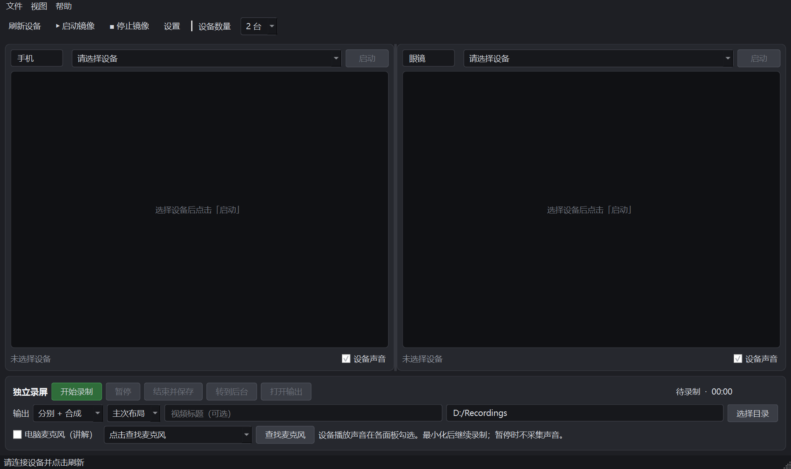
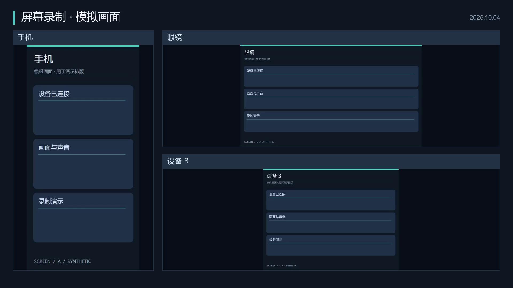

# 多屏录制

多屏录制是一款支持 1～3 台 Android 设备的桌面镜像与录屏软件，可在同一窗口预览并操控手机、Android 眼镜等设备。支持独立开始、暂停、继续和结束录制，窗口隐藏后仍可在后台采集；设备播放声音与电脑麦克风讲解可按需选择。视频既可分别保存，也可合成为带自定义标题、设备名称和布局的 MP4，适用于产品演示、操作培训和多设备流程记录。

当前版本：**0.2.1**。支持 Windows 10/11 和 Linux x86_64（X11）。

## 下载

可执行包在 [GitHub Releases](https://github.com/holdonyb/scrcpy-dual-viewer/releases) 提供：

| 平台 | 文件 | 使用方法 |
| --- | --- | --- |
| Windows 免安装 | `MultiScreenRecorder-0.2.1-windows-x64.exe` | 下载后双击运行。首次启动会解压内置组件，需要稍等几秒。 |
| Windows 安装版 | `MultiScreenRecorder-0.2.1-windows-x64-Setup.exe` | 安装到当前用户目录，通过开始菜单启动，可正常卸载。 |
| Linux 便携版 | `MultiScreenRecorder-0.2.1-linux-x64.tar.gz` | 解压，运行其中的 `MultiScreenRecorder`；需要 Ubuntu 22.04+ 或兼容系统的 X11 桌面。 |

下载包已包含 Python、Qt、scrcpy、adb、FFmpeg、ffprobe 和中文字体，无需另外安装这些工具。Windows 包目前未做代码签名。各文件可使用随附的 `SHA256SUMS` 校验。

设备仍需开启 USB 调试，并在手机或眼镜上授权。Windows 某些设备需安装厂商 USB 驱动。Linux 用户需有 USB 访问权限；Ubuntu 可安装 `android-sdk-platform-tools-common` 提供 udev 规则，添加至 `plugdev` 组后重新登录并重连设备。具体步骤见 [scrcpy Linux 说明](https://github.com/Genymobile/scrcpy/blob/v4.1/doc/linux.md)。

Linux 使用示例：

```bash
tar -xzf MultiScreenRecorder-0.2.1-linux-x64.tar.gz
cd MultiScreenRecorder
./MultiScreenRecorder
```

## 功能

- 选择 1、2 或 3 个设备面板，独立选设备、改名称、启动和停止镜像。
- 独立「开始录制 / 暂停 / 继续 / 结束并保存」，无需先启动镜像。停止镜像不会停止独立录制。
- 各面板单独选择「设备声音」，采集手机、眼镜播放的声音。电脑麦克风用于讲解，可另行勾选并选择输入设备。
- 最小化或关闭到 Windows 托盘后继续录制。托盘菜单可显示窗口，或结束录制、保存视频并退出。
- 分别保存、合成视频或两者都保存；默认 H.264 视频 + AAC 音频的 MP4，合成视频为 1920×1080、30 fps。
- 主次布局：两台时手机窄、眼镜宽；三台时手机在左、另外两路上下排列。也可选择等宽布局；画面保留原始比例。
- 设备刷新保留分配，显示未授权、离线状态。分辨率、码率、帧率、工具路径和导出选项会保存。

## 依赖和运行

- Python 3.10+、PySide6。
- [scrcpy 4.1+](https://github.com/Genymobile/scrcpy/releases) 和 [adb](https://developer.android.com/tools/adb)。
- 录屏还需要 [FFmpeg 和 ffprobe](https://ffmpeg.org/download.html)，包括 libx264、AAC 和 drawtext。电脑麦克风采集目前支持 Windows DirectShow。

```powershell
python -m venv .venv
.\.venv\Scripts\python.exe -m pip install -r requirements.txt
.\.venv\Scripts\python.exe dual_scrcpy_qt.py
```

工具可以放在 PATH，或在「设置」里手动选择。支持 `scrcpy/scrcpy.exe` 和 `scrcpy/scrcpy-win64-vX.Y/scrcpy.exe` 两种便携结构，并优先使用相邻 adb。FFmpeg 支持 `ffmpeg/bin/ffmpeg.exe`，ffprobe 建议放在同目录。

设备需开启 USB 调试，并在设备上允许授权。点「刷新设备」，程序会给当前数量的空面板分配可用设备。只有一台设备时也能录制，空面板不参与输出。

## 录制方法

1. 选择设备数量及各面板的设备，填写用于视频的设备名称。
2. 勾选想录的「设备声音」。需要讲解时点「查找麦克风」，选择电脑输入，再勾选「电脑麦克风（讲解）」。麦克风默认关闭。
3. 选择输出方式、布局、标题与保存目录，点击「开始录制」。标题可留空，输出默认使用“屏幕录制”。镜像用于预览与操作，录制由独立的无窗口进程完成。
4. 点击「暂停」停止当前片段和声音采集，点击「继续」录下一段。最终视频不包含暂停期间的空档。
5. 点击「结束并保存」，等待导出完成，再点「打开输出」。导出期间窗口仍能响应，退出会等待保存完成。

每次录制创建独立的时间戳目录，分别输出以设备名称命名，合成输出为 `合成视频.mp4`。分别输出包含该设备所选声音和可选电脑讲解；合成输出混合所选设备声音，并只加入一次电脑讲解。全部声音关闭时生成无音轨视频。

录制过程中的片段及导出中间文件保留在 `.parts/`，方便错误恢复，可能占用额外空间。`recording.json` 保存导出配置，不保存设备序列号。若导出失败，可修复 FFmpeg、磁盘空间等问题后重试：

```powershell
.\.venv\Scripts\python.exe recording_export.py '录屏目录\recording.json'
# 工具不在 PATH 时，可加 --ffmpeg '完整路径\ffmpeg.exe' --ffprobe '完整路径\ffprobe.exe'
```

重试会重新生成该录屏目录内的输出文件。正常停止会等待 scrcpy 和 FFmpeg 完成文件收尾；如果设备断连、采集报错或关闭超时，界面会显示失败并保留片段，不会把它标成成功录制。

## 设备声音支持

采集的是设备播放音频，不使用手机或眼镜的麦克风。

| 设备系统 | 录制方式与限制 |
| --- | --- |
| Android 13+ | 播放捕获，尽量保留设备自身播放；禁止捕获的应用或固件可能没有相应声音。 |
| Android 11–12 | 系统输出捕获，录制时设备自身播放可能静音；Android 11 开始前应先解锁。 |
| Android 10 及更早，或系统版本无法读取 | 仅录画面，并显示设备声音不可用的提示。 |

依据：[scrcpy 官方音频说明](https://github.com/Genymobile/scrcpy/blob/v4.1/doc/audio.md)。眼镜定制固件、受保护内容、通话音频等仍可能受限制。完成导出后若设备没有提供音轨，程序会提示。

## 平台和限制

- Windows 10/11 支持镜像、独立录屏、电脑麦克风和托盘后台录制。
- Linux 镜像需要 X11；请在登录时选择 Xorg 会话。Wayland 不支持跨进程窗口嵌入。电脑麦克风当前仅支持 Windows；Linux 支持设备播放声音。
- 多设备由独立进程采集，暂停片段会按时长对齐，但不保证帧级同步。镜像和录屏同时运行会增加设备编码负荷，部分固件可能限制并发编码器。
- Qt 嵌入外部窗口后，部分场景的键盘输入受焦点限制；鼠标点击和滑动可用。
- 后台指窗口隐藏或最小化；电脑休眠、设备断连会影响采集。

## 从源码构建下载包

在目标操作系统使用 Python 3.11 安装 `packaging/requirements-build.txt`，再运行：

```bash
python packaging/prepare_tools.py
python packaging/build_release.py
```

脚本校验固定版本依赖的 SHA-256，输出到 `dist/release/`。Windows 还需 Inno Setup 6，生成单文件 EXE 和安装包；Linux 生成可解压运行的完整目录包。GitHub Actions 的 `Build downloadable releases` 可分别构建两个平台，并检查源码、实际下载包、Windows 安装与卸载。第三方组件的授权和源代码信息见 [THIRD_PARTY_NOTICES.md](THIRD_PARTY_NOTICES.md)。

## 验证与效果

```powershell
.\.venv\Scripts\python.exe tests/run_tests.py
```

测试使用受控原生窗口、合成视频和测试音，不采集真实手机或电脑麦克风。覆盖此前七类缺陷修复、隐藏控制台正常收尾、暂停/继续、后台与退出、1～3 路导出、静音、讲解与设备声音混合、旋转和异常恢复。结果见 [回归输出](docs/reviews/2026-10-04/regression-results.txt)。

[合成演示视频（模拟画面）](docs/reviews/2026-10-04/recording-demo/合成视频.mp4)





当前版本已通过 Windows 25 项源码检查、Linux 17 项源码检查，以及两个 Windows 下载包与 Linux 解压包的启动和媒体导出检查。真实固件的声音支持、画质、延迟、旋转和长时间录制仍需实机验收。验证环境和范围见 [验证说明](docs/VALIDATION.md)。

## 旧版

`dual_scrcpy.py` 保留早期 tkinter 版本，启动两个独立 scrcpy 窗口；新增独立录屏使用 Qt 入口。

## License

MIT
